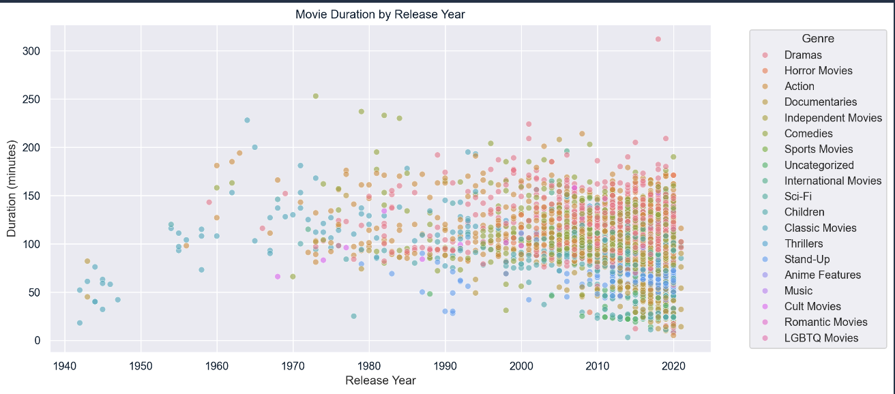
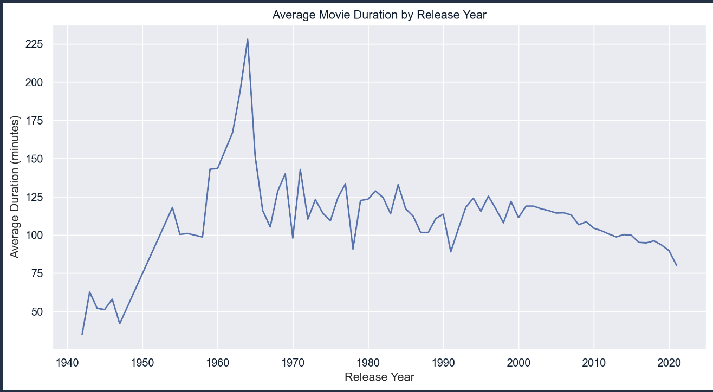
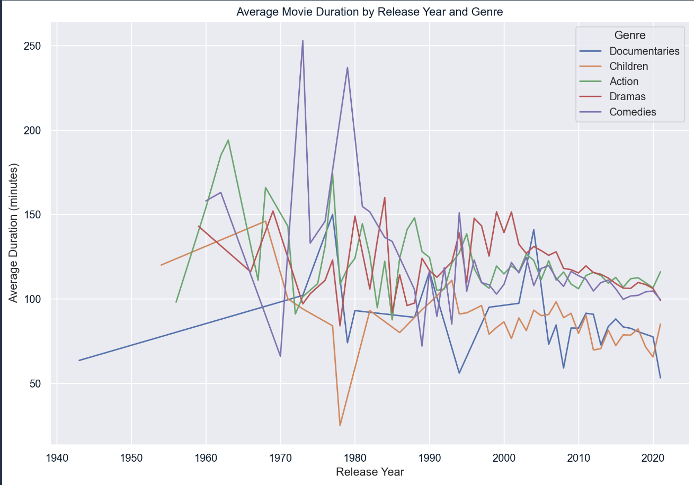

# Netflix Data Analysis

This project analyzes Netflix data and generates various visualizations. The data is generated using the script `generate_netflix_data.py`.

## Steps to Run the Project

1. **Clone the Repository**
   ```bash
   git clone https://github.com/yourusername/sam-netflix.git
   cd sam-netflix
   ```

2. **Set Up a Virtual Environment**

   To create and activate a virtual environment, follow these commands:

   ```bash
   python3 -m venv venv
   source venv/bin/activate
   ```

3. **Install Required Packages**

   After activating your virtual environment, install the necessary Python packages by running:

   ```bash
   pip install pandas matplotlib seaborn
   ```

4. **Generate the Netflix Dataset**

   To generate the Netflix dataset, navigate to the `src` directory and run the `generate_netflix_data.py` script:

   ```bash
   python3 src/generate_netflix_data.py
   ```

5. **Run the Analysis and Visualization**

   After generating the dataset, you can proceed to run the analysis and visualization script. Ensure you are in the root directory of the project, and then execute:

   ```bash
   python3 src/analyze_netflix_data.py
   ```

## Results

### Movie Duration by Release Year


### Average Movie Duration by Release Year


### Average Movie Duration by Release Year and Genre

